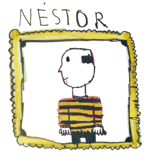

<div align="center">
  
  <p><em><b>Néstor</b> is a personal AI assistant inspired by Tintin's faithful butler 🎩</em></p>
</div>

> [!CAUTION]
> Personal experiment in progress. Features may appear, disappear, or mutate
> without warning 🧪

## Quick Start

Néstor is developed with Python 3.14, and requires
[uv](https://github.com/astral-sh/uv).

```bash
# Clone the repository
git clone https://github.com/elatomo/nestor.git
cd nestor

# Install Python 3.14 (if needed)
# Option A: via asdf
asdf install

# Option B: via uv
uv python install

# Install dependencies
uv sync

# Set up configuration
cp .env.example .env
# Edit .env with your OpenAI API key

# Your $0.0001 time check ⏰
uv run nestor ask "Hey Néstor, what time is it?"
```
